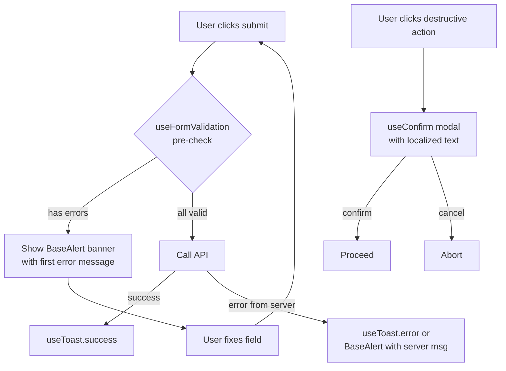

# Plan — Alert Consistency + Form Validation Alerts

> Indonesian request: "kamu pelajari semua program nya setiap alert sesuaikan dan kalau ada yang colum tidak terisi dan klik kirim itu kasi alert perbaiki alert nya dan warna nya sesuaikan bikin planing dulu baru perbaiki"
>
> Translation: *Study the entire program. Make every alert consistent, and if there are fields not filled and the user clicks submit, show an alert. Fix the alerts and adjust the colors. Make a plan first, then fix.*

This plan was produced from a thorough code audit of all Vue/JS files under `frontend/src/`. No code has been changed yet — implementation will start only after user approval.

---

## 1. Current State — Inventory of Alert Infrastructure

### 1.1 Existing composables (canonical, work well)

| File | Purpose | Status |
|------|---------|--------|
| [`frontend/src/composables/useToast.js`](frontend/src/composables/useToast.js) | Non-blocking notification API. `showToast(message, type)` where `type ∈ {success, error, info, warning}`. Auto-dismiss after 3s. Global singleton via `toastState` ref. | ✅ Good — already used in 11 places |
| [`frontend/src/composables/useConfirm.js`](frontend/src/composables/useConfirm.js) | Promise-based confirm dialog. `confirm({title, message, confirmText, cancelText, type})`, plus helpers `confirmDelete`, `confirmBlock`, `confirmAction`. Resolves `true`/`false`. Types: `warning`, `danger`, `info`, `success`. | ⚠️ Defined but **NEVER imported** by any view |
| [`frontend/src/components/ui/ToastNotification.vue`](frontend/src/components/ui/ToastNotification.vue) | Pill-shaped toast at top center. Color-coded by type (emerald/red/blue/yellow). Has icon + dismiss-on-click. | ✅ Good |
| [`frontend/src/components/ui/ConfirmModal.vue`](frontend/src/components/ui/ConfirmModal.vue) | Full modal w/ backdrop, ESC + Enter support, type-tinted icon + button. Props-based (uses `v-model:modelValue`). | ✅ Good — but rendered only when explicitly mounted by a view |
| [`frontend/src/components/ui/BaseModal.vue`](frontend/src/components/ui/BaseModal.vue) | Generic modal shell (teleport + backdrop). | ✅ Good |
| [`frontend/src/components/ui/ErrorCard.vue`](frontend/src/components/ui/ErrorCard.vue) | Severity-coded error block (`severity-error`, `severity-warning`, `severity-info`). | ✅ Exists, not heavily used |

### 1.2 Inconsistencies found (audit results)

#### A. Browser-native `confirm()` with hardcoded text — **6 occurrences**

These bypass the design system entirely and break i18n (Indonesian/English hardcoded strings):

| File | Line | Current code | Issue |
|------|------|--------------|-------|
| [`frontend/src/views/admin/RequestDetail.vue`](frontend/src/views/admin/RequestDetail.vue:770) | 770 | `confirm('Verifikasi dan setujui bukti pembayaran ini?')` | Hardcoded Indonesian, no i18n, browser-native dialog |
| [`frontend/src/views/admin/RequestDetail.vue`](frontend/src/views/admin/RequestDetail.vue:812) | 812 | `confirm('Selesaikan pesanan? (Sudah verifikasi B/L dan penerimaan?)')` | Hardcoded Indonesian, no i18n |
| [`frontend/src/views/admin/RequestDetail.vue`](frontend/src/views/admin/RequestDetail.vue:845) | 845 | Template literal w/ hardcoded `"Kirim via Trusted Provider"` / `"Tugaskan driver ini"` | Hardcoded Indonesian, no i18n |
| [`frontend/src/components/ui/ImageGallery.vue`](frontend/src/components/ui/ImageGallery.vue:172) | 172 | `confirm('Delete this image?')` | Hardcoded English, no i18n |
| [`frontend/src/components/chat/ChatComponent.vue`](frontend/src/components/chat/ChatComponent.vue:367) | 367 | `confirm("Are you sure you want to delete this message?")` | Hardcoded English, no i18n |

(Two more — lines 728, 1360 — already use `t()` for the message string but still call native `confirm()`. They will also be migrated.)

#### B. Browser-native `alert(` — **0 occurrences** ✅

#### C. Form validation gaps — **5 forms lack pre-submit field checks**

Every form below has a "kirim" (submit) button but does NOT validate required fields client-side; users get either no feedback or only a server 422 toast:

| File | Submit button | Current pre-submit validation |
|------|---------------|------------------------------|
| [`frontend/src/views/auth/Login.vue`](frontend/src/views/auth/Login.vue:96) | `@submit.prevent="handleSubmit"` | **None** — `email`/`password` empty → 422 from server only |
| [`frontend/src/views/auth/SetNewPassword.vue`](frontend/src/views/auth/SetNewPassword.vue) | (TBD read) | (TBD) |
| [`frontend/src/views/supplier/Register.vue`](frontend/src/views/supplier/Register.vue:52) | `@submit.prevent="handleSubmit"` | Only validates password match + length. No check for empty `full_name`, `email`, `company_name`, missing `accept_terms` |
| [`frontend/src/views/buyer/RFQCreate.vue`](frontend/src/views/buyer/RFQCreate.vue) | "Submit Request" button | **None** — no check that `productName`, `category`, `quantity`, `unit`, `budgetRange`, `deliveryTimeline` are filled |
| [`frontend/src/views/buyer/Settings.vue`](frontend/src/views/buyer/Settings.vue) | "Save profile" button | Checks `phoneError` only — doesn't check `full_name` empty, etc. |
| [`frontend/src/views/admin/Suppliers.vue`](frontend/src/views/admin/Suppliers.vue) | "Create supplier" modal | (TBD read) |
| [`frontend/src/views/admin/Drivers.vue`](frontend/src/views/admin/Drivers.vue) | "Create driver" modal | (TBD read) |
| [`frontend/src/components/chat/ChatComponent.vue`](frontend/src/components/chat/ChatComponent.vue:165) | "Send" button | Guarded by `:disabled="(!newMessage.trim() && !selectedFile) || sending"` — ✅ already validated |

### 1.3 Tailwind color scheme used by existing alerts

From [`frontend/tailwind.config.js`](frontend/tailwind.config.js):

```
primary            #3525cd   (indigo-ish)
primary-hover      #4f378a
status-pending-*   #fef3c7 / #92400e   (amber-100 / amber-800)
status-processing-*#dbeafe / #1e40af   (blue-100 / blue-800)
status-completed-* #d1fae5 / #065f46   (emerald-100 / emerald-800)
```

Existing alert components consistently use:
- **Success** → `emerald-50` bg, `emerald-200` border, `emerald-700` text
- **Error** → `rose-50`/`red-50` bg, `rose-200`/`red-200` border, `rose-700`/`red-700` text
- **Info** → `blue-50` bg, `blue-200` border, `blue-700` text
- **Warning** → `yellow-50`/`amber-50` bg, `yellow-200`/`amber-200` border, `yellow-700`/`amber-700` text

**Inconsistency**: errors use *two* different reds — `red-*` (Login/RFQCreate) and `rose-*` (Settings/Supplier Register). Need to converge.

---

## 2. Goals

1. **Single alert API** — every notification goes through `useToast()`, every confirmation goes through `useConfirm()`. No more browser-native dialogs.
2. **i18n everywhere** — every user-facing string in alerts/confirmations comes from `frontend/src/locales/*.json`. No more hardcoded Indonesian/English.
3. **Pre-submit validation** — every form with a submit button checks required fields and shows a localized toast/error-banner listing missing fields.
4. **Unified color palette** — all error/toast surfaces use the same Tailwind shade (decide: `red-*` vs `rose-*`, see §5 below).
5. **Zero regression** — existing 649 i18n keys stay intact, no visual change for already-correct flows.

---

## 3. Color Standard — Decision

| Alert type | Background | Border | Text | Icon |
|------------|-----------|--------|------|------|
| **success** | `bg-emerald-50 dark:bg-emerald-950/60` | `border-emerald-200 dark:border-emerald-800` | `text-emerald-700 dark:text-emerald-300` | `check_circle` |
| **error**   | `bg-rose-50 dark:bg-rose-950/60`       | `border-rose-200 dark:border-rose-800`     | `text-rose-700 dark:text-rose-300`     | `error` |
| **warning** | `bg-amber-50 dark:bg-amber-950/60`     | `border-amber-200 dark:border-amber-800`   | `text-amber-700 dark:text-amber-300`   | `warning` |
| **info**    | `bg-blue-50 dark:bg-blue-950/60`       | `border-blue-200 dark:border-blue-800`     | `text-blue-700 dark:text-blue-300`     | `info` |

**Decision: use `rose-*` (not `red-*`)** — `rose-*` is already used in 3 places (Login.vue, Register.vue, Settings.vue) and matches the Tailwind pink/rose range which is the modern convention. The 2 places using `red-*` (RFQCreate.vue error banner) will be migrated to `rose-*`.

---

## 4. Architecture — New `BaseAlert` Banner Component

There are 4 ad-hoc inline alert banners across views (Login, Register, Settings, RFQCreate). Extract them into a reusable component:

[`frontend/src/components/ui/BaseAlert.vue`](frontend/src/components/ui/BaseAlert.vue)

Props: `type` ('success' | 'error' | 'warning' | 'info'), `message` (string). Optional `dismissible` flag.

This replaces inline JSX like:
```vue
<div v-if="errorMsg" class="mb-5 p-3.5 bg-rose-50 ...">
  <span class="material-symbols-outlined text-rose-500 text-lg shrink-0">error</span>
  <span>{{ errorMsg }}</span>
</div>
```

with:
```vue
<BaseAlert v-if="errorMsg" type="error" :message="errorMsg" />
```

**Benefit**: one place to tune colors/typography/a11y.

---

## 5. Validation Strategy

### 5.1 New composable — `useFormValidation`

[`frontend/src/composables/useFormValidation.js`](frontend/src/composables/useFormValidation.js)

Returns:
- `errors` — `reactive` object keyed by field name
- `validate(rules)` — accepts `{ fieldName: (value) => true | string }`, sets `errors[fieldName] = 'error message'`, returns `true` if all pass
- `clearErrors()` / `clearError(fieldName)`
- `errorCount` — computed number of errors

Example usage:
```js
const { errors, validate } = useFormValidation()

const submit = async () => {
  if (!validate({
    email: v => !!v || t('validation.email_required'),
    password: v => (v && v.length >= 6) || t('validation.password_min'),
  })) {
    showToast(t('validation.fix_errors'), 'error')
    return
  }
  // ... submit
}
```

### 5.2 New i18n namespace — `validation`

Add to all 4 locales under [`frontend/src/locales/en.json`](frontend/src/locales/en.json) (and mirror to id/fr/zh — ~25 keys):

```json
"validation": {
  "fix_errors": "Please fix the errors before submitting.",
  "required": "This field is required.",
  "email_required": "Email is required.",
  "email_invalid": "Please enter a valid email address.",
  "password_required": "Password is required.",
  "password_min": "Password must be at least 6 characters.",
  "password_match": "Passwords do not match.",
  "phone_required": "Phone number is required.",
  "phone_invalid": "Please enter a valid phone number.",
  "name_required": "Full name is required.",
  "company_required": "Company name is required.",
  "terms_required": "You must accept the terms and conditions.",
  "product_required": "Product name is required.",
  "category_required": "Category is required.",
  "quantity_required": "Quantity is required.",
  "unit_required": "Unit is required.",
  "budget_required": "Budget range is required.",
  "delivery_required": "Delivery timeline is required."
}
```

(Will need translations for id/fr/zh — keys are subject-agnostic so translators can map easily.)

---

## 6. Phase Plan

### Phase 1 — Infrastructure (composable + base component + i18n)
*No view changes yet — pure foundation.*

1. Create [`frontend/src/composables/useFormValidation.js`](frontend/src/composables/useFormValidation.js)
2. Create [`frontend/src/components/ui/BaseAlert.vue`](frontend/src/components/ui/BaseAlert.vue)
3. Add `validation` namespace (~25 keys) to `en.json`, `id.json`, `fr.json`, `zh.json`
4. Add `confirm.*` keys for the 6 hardcoded messages (`confirm.verify_payment`, `confirm.complete_order`, `confirm.assign_driver`, `confirm.trusted_provider`, `confirm.delete_image`, `confirm.delete_message`, `confirm.open_discussion`)
5. Verify all 4 locale files have identical key structure (one-shot diff)

### Phase 2 — Migrate native `confirm()` → `useConfirm()` (6 spots)

For each:
- Replace `if (!confirm('text')) return` with `if (!await confirmAction(title, message, type)) return`
- Wire `const { confirmAction } = useConfirm()` at top of `<script setup>`
- For admin `RequestDetail.vue` 3 confirmations: type = `'success'` (verifyPayment), `'success'` (completeOrder), `'info'` (assignDriver)
- For `ImageGallery.vue` and `ChatComponent.vue`: type = `'danger'`, use `confirmDelete(name)` helper
- Ensure `ConfirmModal` is mounted once at app root (add to [`frontend/src/App.vue`](frontend/src/App.vue))

### Phase 3 — Migrate inline alert banners → `<BaseAlert>` (4 views)

- [`frontend/src/views/auth/Login.vue`](frontend/src/views/auth/Login.vue) — errorMsg + successMsg banners
- [`frontend/src/views/auth/SetNewPassword.vue`](frontend/src/views/auth/SetNewPassword.vue) — same pattern (read first)
- [`frontend/src/views/supplier/Register.vue`](frontend/src/views/supplier/Register.vue) — same pattern
- [`frontend/src/views/buyer/Settings.vue`](frontend/src/views/buyer/Settings.vue) — same pattern
- [`frontend/src/views/buyer/RFQCreate.vue`](frontend/src/views/buyer/RFQCreate.vue) — errorMsg + change `red-*` → `rose-*` to match standard

### Phase 4 — Add form validation to submit handlers

Per form, add `useFormValidation` and pre-submit checks:

| Form | Required fields to validate |
|------|------------------------------|
| Login (login mode) | `email`, `password` |
| Login (register mode) | `contact_person`, `email`, `password`, `phone`, `company_name` |
| Register | `full_name`, `email`, `password` (already), `password_confirmation`, `company_name`, `accept_terms` |
| RFQCreate | `productName`, `category`, `quantity`, `unit`, `budgetRange`, `deliveryTimeline` |
| Settings (buyer) | `full_name`, `phone` (if provided) |
| Supplier create modal (admin) | (TBD read) |
| Driver create modal (admin) | (TBD read) |

For each form: show `<BaseAlert>` summarizing the first missing field, and per-field inline error text below the input (using `errors.fieldName`).

### Phase 5 — Verification

1. `cd frontend && npm run build` — must succeed with no warnings
2. `cd frontend && PLAYWRIGHT_SKIP_BROWSER_DOWNLOAD=1 node <e2e-alerts.cjs>` — Playwright walkthrough:
   - Submit empty Login → error toast + banner appears
   - Submit RFQ with empty product name → error appears
   - Try `confirm()` in admin RequestDetail → modal appears (not browser dialog)
   - Switch language to `id` → alert text is Indonesian
3. `cp frontend/dist/index.html backend/public/index.html` + `cp frontend/dist/assets/* backend/public/assets/` (without `--delete`)
4. `php -S 127.0.0.1:8765 -t backend/public` + HTTP 200 checks

---

## 7. Files to be Created

| File | Lines (est.) |
|------|--------------|
| [`frontend/src/composables/useFormValidation.js`](frontend/src/composables/useFormValidation.js) | ~50 |
| [`frontend/src/components/ui/BaseAlert.vue`](frontend/src/components/ui/BaseAlert.vue) | ~60 |

## 8. Files to be Edited

| File | Changes |
|------|---------|
| [`frontend/src/App.vue`](frontend/src/App.vue) | Mount `<ConfirmModal>` once globally |
| [`frontend/src/views/auth/Login.vue`](frontend/src/views/auth/Login.vue) | Migrate banners → `<BaseAlert>`, add validation in both modes |
| [`frontend/src/views/auth/SetNewPassword.vue`](frontend/src/views/auth/SetNewPassword.vue) | Migrate banner + add validation |
| [`frontend/src/views/supplier/Register.vue`](frontend/src/views/supplier/Register.vue) | Migrate banner + add validation |
| [`frontend/src/views/buyer/RFQCreate.vue`](frontend/src/views/buyer/RFQCreate.vue) | Migrate banner (red→rose) + add validation |
| [`frontend/src/views/buyer/Settings.vue`](frontend/src/views/buyer/Settings.vue) | Migrate banner + add validation |
| [`frontend/src/views/admin/Suppliers.vue`](frontend/src/views/admin/Suppliers.vue) | Add validation to create-modal |
| [`frontend/src/views/admin/Drivers.vue`](frontend/src/views/admin/Drivers.vue) | Add validation to create-modal |
| [`frontend/src/views/admin/RequestDetail.vue`](frontend/src/views/admin/RequestDetail.vue) | 3× `confirm()` → `useConfirm()` |
| [`frontend/src/views/buyer/RequestDetail.vue`](frontend/src/views/buyer/RequestDetail.vue) | 1× `confirm()` → `useConfirm()` |
| [`frontend/src/components/ui/ImageGallery.vue`](frontend/src/components/ui/ImageGallery.vue) | 1× `confirm()` → `useConfirm()` |
| [`frontend/src/components/chat/ChatComponent.vue`](frontend/src/components/chat/ChatComponent.vue) | 1× `confirm()` → `useConfirm()` |
| [`frontend/src/locales/en.json`](frontend/src/locales/en.json) | +`validation.*` (~25 keys), +`confirm.*` (~7 keys) |
| [`frontend/src/locales/id.json`](frontend/src/locales/id.json) | Same |
| [`frontend/src/locales/fr.json`](frontend/src/locales/fr.json) | Same |
| [`frontend/src/locales/zh.json`](frontend/src/locales/zh.json) | Same |

---

## 9. Risk & Rollback

- **Risk**: Adding `useFormValidation` to many views could break happy-path submit if validation is too strict.
  - *Mitigation*: rules are pure functions of the form value; existing server-side validation already rejects these. Adding client-side pre-check is additive.
- **Risk**: Global `<ConfirmModal>` mount in [`App.vue`](frontend/src/App.vue) might conflict if some view already mounts it.
  - *Mitigation*: Search shows no view mounts it. Safe to add.
- **Rollback**: Each phase is independent; phases 2/3/4 can be reverted individually by `git checkout HEAD -- <file>`.

---

## 10. Out of Scope

- Backend-side validation already exists (Laravel FormRequests). No backend changes in this plan.
- SweetAlert / new library — not needed; existing `useToast` + `useConfirm` cover all use cases.
- Accessibility (aria-live regions for toast) — nice-to-have, can be a follow-up.
- Animation timing changes — not requested.

---

## 11. Workflow Diagram



---

## 12. Next Step

Awaiting user approval. After approval, I will switch to `code` mode and execute Phases 1 → 5 in order, with build + Playwright verification at the end.
